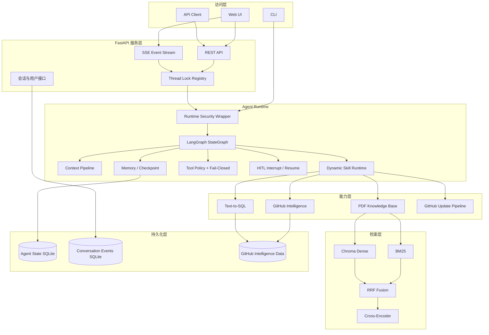
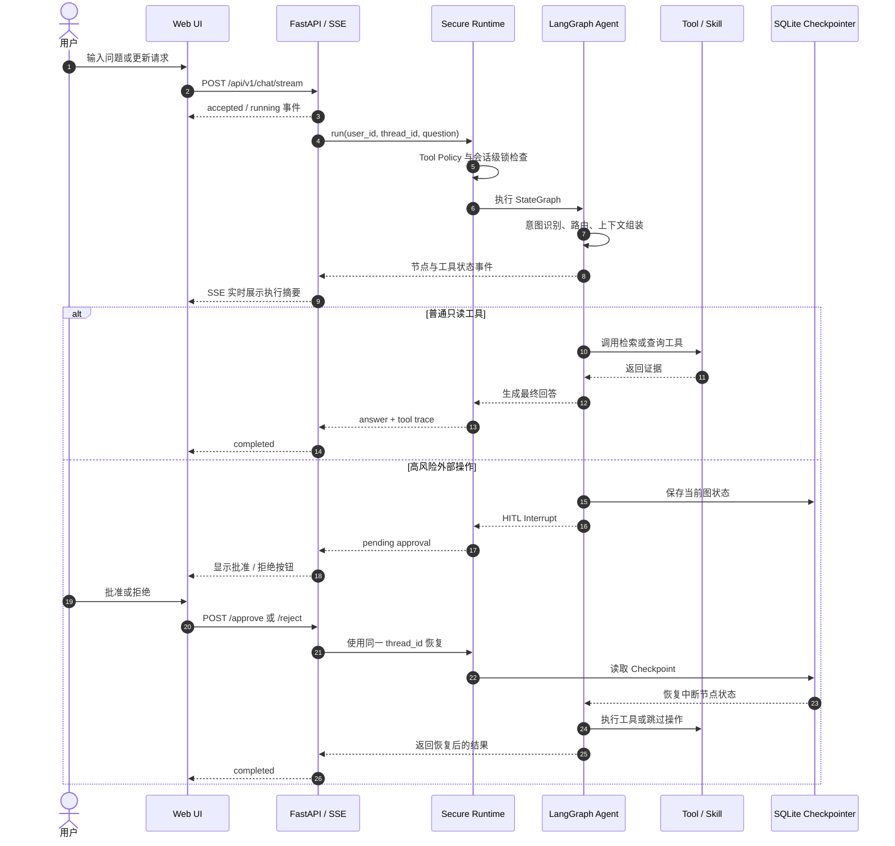
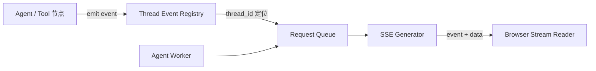
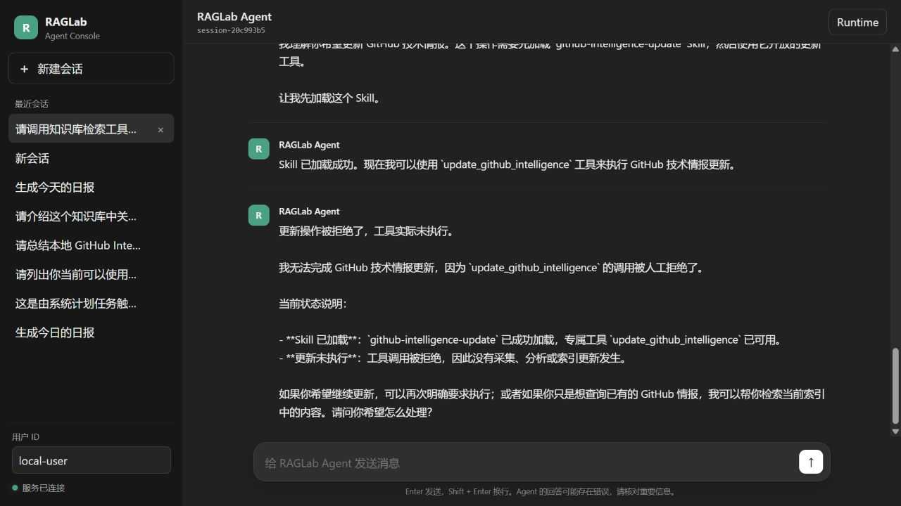
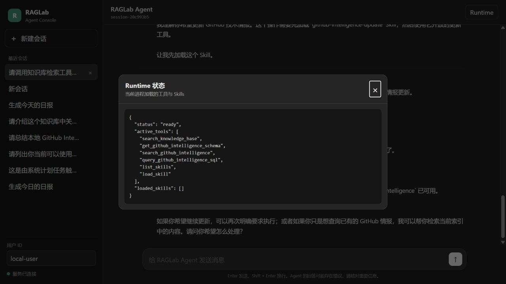

# RAGLab Agent

[](https://github.com/daxianyu233/raglab-agent/actions/workflows/tests.yml)
[](https://www.python.org/)
[](https://fastapi.tiangolo.com/)
[](https://github.com/langchain-ai/langgraph)
[](https://docs.docker.com/compose/)

面向工程实践的 **GitHub 技术情报与知识检索 Agent**。项目不止于一次 RAG
调用，而是围绕 LangGraph Agent Runtime 构建了完整后端链路：混合检索、
Tool Calling、动态 Skill、Memory、上下文预算、HITL 人工审批、安全策略、
任务调度、会话持久化、SSE 运行状态和自动化评测。

> [!IMPORTANT]
> 当前 Agent 依赖真实 LLM 完成意图识别、工具路由和回答生成。启动完整服务必须
> 提供自己的 `DEEPSEEK_API_KEY`；仓库不会提供、上传或内置任何 API Key，也没有
> 使用固定答案伪造无模型 Demo。

## 项目定位

RAGLab Agent 面向以下场景：

- 从本地 PDF 知识库检索 Agent、LangGraph、Checkpoint 等技术资料。
- 对 GitHub 仓库元数据、结构化分析和技术日报进行语义检索或 Text-to-SQL 查询。
- 通过动态 Skill 加载受控的 GitHub Intelligence 更新能力。
- 在执行高风险外部操作前产生 HITL Interrupt，等待人工批准或拒绝。
- 使用同一 `thread_id` 恢复 Checkpoint，继续被中断的 Agent 状态图。
- 通过 Web、FastAPI 或 CLI 复用同一套安全 Agent Runtime。

## 核心能力

| 能力 | 实现 |
|---|---|
| Agent Runtime | LangGraph / StateGraph、状态流转、多步 Tool Calling |
| Dynamic Skill | 运行时发现、加载 Skill，并动态开放专属工具 |
| RAG | Chroma Dense、BM25、RRF、Cross-Encoder Reranker |
| Structured Query | GitHub Intelligence Schema 与受控 Text-to-SQL |
| Memory | Checkpoint、近期上下文、历史会话检索、长期记忆 |
| Context Pipeline | Token 预算、工具证据配对、长上下文压缩 |
| Safety | Tool Policy、Fail-Closed、HITL、参数与作用域校验 |
| Reliability | Scheduler、状态机、Single-Flight、会话级锁、SQLite 持久化 |
| API / UI | FastAPI、OpenAPI、SSE、多会话 Web UI |
| Evaluation | API 契约测试、Agent E2E Benchmark、上下文与检索评测 |
| Delivery | Docker Compose、非 root 容器、健康检查、GitHub Actions CI |

## 系统架构



## Agent 执行与 HITL 恢复流程



### SSE 状态传递

Agent 在 Worker 线程中执行；FastAPI 的 SSE 生成器负责持续读取该请求对应的事件
队列并向浏览器 `yield` 标准 SSE 消息。运行时通过 `thread_id` 找到当前会话对应的
事件通道，使 LangGraph 节点发生跳转后仍能把状态发送到同一条浏览器连接。会话级
锁避免同一线程被两个请求同时恢复，不同线程则可以独立执行。



## 页面截图

### 多会话 Web UI

左侧管理用户和历史会话，中间显示持久化消息；页面底部在 Agent 执行期间显示
结构化运行状态，并在出现 HITL Interrupt 时显示审批操作。



### Runtime 工具与 Skill 状态

Runtime 面板展示当前进程已经开放的基础工具，以及本次运行已动态加载的 Skills。



## 快速开始

### 运行要求

- Python 3.11，或 Docker Engine + Docker Compose。
- 有效的 DeepSeek API Key。
- 可选的 GitHub Token：用于提高 GitHub REST API 请求限额。
- 首次启动需要加载 PDF、构建 BM25 索引，并加载 Embedding / Reranker 相关依赖，
  因此会比普通 FastAPI 应用启动更慢。

### 方式一：Docker Compose（推荐）

```powershell
git clone https://github.com/daxianyu233/raglab-agent.git
Set-Location raglab-agent
Copy-Item .env.example .env
```

编辑 `.env`：

```dotenv
DEEPSEEK_API_KEY=your-real-deepseek-api-key
GITHUB_TOKEN=your-optional-github-token
DEEPSEEK_BASE_URL=https://api.deepseek.com
DEEPSEEK_MODEL=deepseek-v4-flash
```

构建并启动：

```powershell
docker compose up --build
```

后台启动与查看日志：

```powershell
docker compose up --build -d
docker compose ps
docker compose logs -f raglab-api
```

停止服务：

```powershell
docker compose down
```

如需同时删除本项目的 Docker named volumes，请明确确认数据不再需要后执行：

```powershell
docker compose down -v
```

容器使用非 root 用户运行。Agent 状态、会话事件、技术情报数据、模型缓存与报告
保存在 named volumes 中，不会写入镜像，也不会提交到 GitHub。

### 方式二：Conda 本地运行

```powershell
conda activate raglab
python -m pip install -r requirements.txt
$env:DEEPSEEK_API_KEY="your-real-deepseek-api-key"
$env:GITHUB_TOKEN="your-optional-github-token"
python -m uvicorn raglab.api.app:app --host 127.0.0.1 --port 8765
```

如果 `8765` 已被占用，可以更换端口：

```powershell
python -m uvicorn raglab.api.app:app --host 127.0.0.1 --port 8766
```

### 方式三：CLI

在项目根目录运行：

```powershell
conda activate raglab
python -m scripts.chat_automatic_memory_agent `
  --user-id local-user `
  --thread-id cli-demo
```

CLI 与 FastAPI 使用相同的 Agent、Memory、Checkpoint 和安全执行逻辑；
`thread_id` 用于恢复同一条会话状态。

## 访问地址

| 地址 | 功能 |
|---|---|
| <http://127.0.0.1:8765> | 多会话 Web UI |
| <http://127.0.0.1:8765/docs> | Swagger / OpenAPI 调试界面 |
| <http://127.0.0.1:8765/api/v1/health> | 健康检查 |
| <http://127.0.0.1:8765/api/v1/runtime> | 当前工具和 Skill 状态 |

## 主要 API

| 方法 | 路径 | 说明 |
|---|---|---|
| `POST` | `/api/v1/chat` | 同步执行一次 Agent 请求 |
| `POST` | `/api/v1/chat/stream` | 通过 SSE 返回运行状态和最终结果 |
| `GET` | `/api/v1/hitl/pending` | 查询指定线程最新状态中的待审批中断 |
| `POST` | `/api/v1/approve` | 批准并恢复待处理 HITL |
| `POST` | `/api/v1/reject` | 拒绝并恢复待处理 HITL |
| `POST` | `/api/v1/threads` | 创建会话 |
| `GET` | `/api/v1/threads` | 按用户列出会话 |
| `GET` | `/api/v1/threads/{thread_id}/messages` | 读取持久化消息 |
| `DELETE` | `/api/v1/threads/{thread_id}` | 删除会话及对应 Checkpoint |
| `GET` | `/api/v1/users` | 列出本地已有用户 ID |

同步调用示例：

```powershell
$body = @{
  question = "请介绍知识库中关于 LangGraph Checkpoint 的内容"
  user_id = "demo-user"
  thread_id = "session-demo"
  include_tool_trace = $true
} | ConvertTo-Json

Invoke-RestMethod `
  -Method Post `
  -Uri "http://127.0.0.1:8765/api/v1/chat" `
  -ContentType "application/json" `
  -Body $body
```

建议优先使用 Swagger 验证 JSON 接口，使用 Web UI 验证 SSE、多轮会话、会话恢复
和 HITL 完整流程。

## HITL 操作示例

1. 新建会话并输入：`请更新今天的 GitHub 技术情报。`
2. Agent 加载 `github-intelligence-update` Skill，并准备调用更新工具。
3. Tool Policy 将外部写操作转换为 HITL Interrupt。
4. Web UI 收到 `pending approval` 并显示批准、拒绝按钮。
5. 点击批准后，后端从 Checkpoint 恢复并真正执行；点击拒绝则恢复图但跳过外部操作。
6. 刷新页面或重新打开会话时，前端会再次查询该 `thread_id` 的待审批状态。

> [!WARNING]
> “批准”可能触发真实 GitHub 数据采集、LLM 分析、索引更新和 API 费用。测试
> HITL 展示时可以选择“拒绝”，确认运行环境和数据范围后再批准。

## 自动化测试

FastAPI 契约测试注入有状态 Fake Runtime，不调用真实 LLM，也不会更新生产数据：

```powershell
python -m pytest tests/test_api.py -q -p no:cacheprovider
```

当前 API 测试覆盖请求参数校验、会话持久化、用户隔离、同步 Chat、POST SSE、
HITL pending 查询与恢复、会话级锁、Agent 错误映射和删除流程。

GitHub Actions 会在 `push` 和 `pull_request` 时使用 Python 3.11 与 CPU-only
PyTorch 执行源码检查和 40 项 FastAPI 自动化测试，并在测试通过后验证 Docker
镜像能够完整构建。

## Agent Benchmark

完整 E2E Benchmark 会调用真实 LLM，并基于真实 Agent Runtime 检查工具路由、
检索决策、工具调用精简度、记忆召回、人工审批合规性、错误恢复、线程隔离、
上下文预算和持久化行为。

```powershell
python -m scripts.run_full_agent_benchmark
```

只运行单个案例：

```powershell
python -m scripts.run_full_agent_benchmark --case hitl_reject
```

最近一次完整运行结果：

| 指标 | 结果 |
|---|---:|
| 总案例 | 20 |
| 通过 | 20 |
| 失败 | 0 |
| 任务完成率（Task Success Rate） | 100% |
| 工具路由准确率（Tool Routing Accuracy） | 100% |
| 检索决策准确率（Retrieval Decision Accuracy） | 100% |
| 工具最简调用率（Tool Minimality） | 100% |
| 记忆召回准确率（Memory Recall Accuracy） | 100% |
| 人工审批合规率（HITL Compliance） | 100% |
| 错误恢复成功率（Error Recovery Rate） | 100% |

Benchmark 会产生模型调用费用，结果也可能受到模型版本、网络和数据状态影响。
评测结果来自真实 Agent Runtime；项目不通过弱化断言伪造通过率。

## 环境变量

| 变量 | 必需 | 用途 |
|---|---:|---|
| `DEEPSEEK_API_KEY` | 是 | Agent 意图识别、路由与回答生成 |
| `GITHUB_TOKEN` | 否 | 提高 GitHub REST API 限额 |
| `DEEPSEEK_BASE_URL` | 否 | DeepSeek 兼容接口地址 |
| `DEEPSEEK_MODEL` | 否 | 部分技术情报脚本的模型覆盖项 |

`.env` 已被 Git 忽略。请勿把 API Key、SQLite 数据库、日志、报告中的个人信息或
本地对话数据提交到公开仓库。

## 项目结构

```text
raglab/
├── agent/                 # LangGraph Agent 与长期记忆 Agent
├── api/                   # FastAPI、SSE、静态 Web UI
├── context/               # Context Pipeline、预算、压缩、审计
├── control/               # Runtime Security、Tool Policy、HITL
├── evaluation/            # Agent、Context、Retrieval 评测实现与数据集
├── generation/            # LLM 与 RAG Chain
├── ingestion/             # PDF 加载与 Chunk 构建
├── intelligence/          # GitHub 技术情报采集、分析与查询
├── memory/                # 会话事件、长期记忆与持久化适配
├── retrieval/             # BM25、Dense、Hybrid、Reranker
└── tools/                 # Agent Tool 定义与执行入口

config/                    # Agent、检索、模型与情报任务配置
skills/                    # 可动态发现和加载的 Skills
scripts/                   # CLI、索引、采集、调度与 Benchmark 入口
tests/                     # FastAPI 自动化测试
data/corpus/               # 示例 PDF 知识库
Dockerfile                 # CPU-only Python 3.11 容器
compose.yaml               # 本地一键启动与持久化 volumes
```

## 安全与可靠性设计

- **Fail-Closed**：工具没有明确策略时默认拒绝执行。
- **Tool Policy**：按工具风险、来源与运行环境决定允许、拒绝或请求审批。
- **HITL**：外部高风险操作必须经人工批准，拒绝不会执行真实工具。
- **Checkpoint Resume**：审批后恢复原 StateGraph，不从头重放完整任务。
- **Single-Flight**：避免调度任务或外部副作用重复执行。
- **Thread Lock**：同一会话串行化运行，不同会话相互隔离。
- **Secret Isolation**：Key 仅由环境变量注入，不写入 Docker 镜像和 Git。
- **Local Binding**：Compose 默认只绑定 `127.0.0.1:8765`，避免未鉴权接口暴露到局域网。

## 当前边界与后续计划

当前版本主要用于本地工程实践和作品展示，仍有以下边界：

- 没有 DeepSeek Key 时无法启动完整 Agent。
- 当前 Web 用户是本地 `user_id` 隔离，还没有注册、登录、JWT 与完整 RBAC。
- SSE 使用进程内事件通道，尚未实现跨进程事件总线和断线补发。
- SQLite 适合单机演示，公开多实例部署前需要迁移数据库与任务执行架构。
- 公开部署还需补充鉴权、限流、费用配额、HTTPS、日志脱敏和监控告警。

下一阶段计划：

1. 统一 Agent 结构化事件模型并补齐节点耗时。
2. 建立持久化 Job 状态机与 SSE 断线续传。
3. 建立 RAG 标注集，量化 BM25、Dense、RRF 和 Reranker 的 Recall@K、MRR 与延迟。
4. 扩展 HITL、异常恢复与并发稳定性测试。
5. 增加用户认证、资源所有权验证和生产部署配置。
